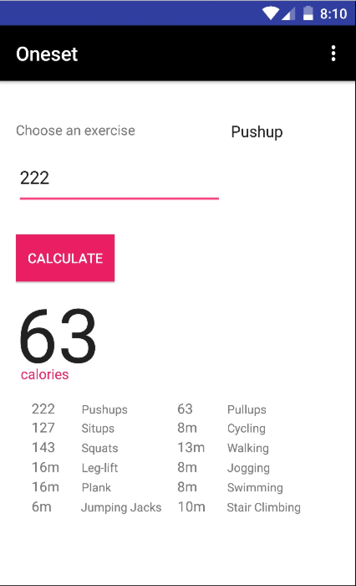

# PROG 01: Oneset

This application's purpose is to calculate the number of calories you burn when performing certain repetitions/minutes of a specific type of exercise. By choosing the type of exercise, then entering the amount of work you did, the application calculate not only the calories you burned, but also tells you how many minutes/repetitions you could have spent/done in another exercise in order to burn the same amount of calories.

## Authors

Hamza Ahmed ([hamza.ah@berkeley.edu](mailto:hamza.ah@berkeley.edu))

## Demo Video

See [my Oneset demo video here] (https://www.youtube.com/watch?v=Dw0JOI7Nquw)

## Screenshots

## Acknowledgments

StackOverflow and the Android Developer Guide were used extensively throughout this project.
